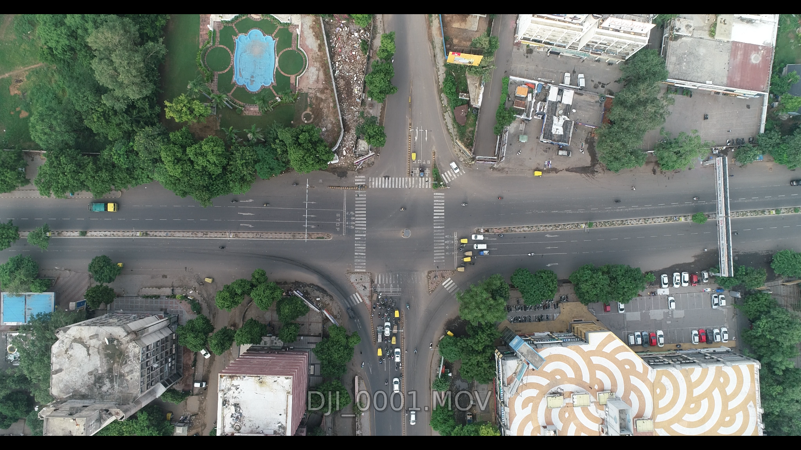

# SkyEye dataset
<h2>Dataset for analyzing lane-less traffic behavior at intersections </h2>

Part of the [M2Smart project!](http://m2smart.org/en/)  

  

The SkyEye dataset is the first aerial dataset for monitoring intersections with mixed traffic and lane-less behavior. Around 1 hour of video each from 4 intersections, namely, Paldi (P), Nehru bridge - Ashram road (N), Swami Vivekananda bridge - Ashram road (V), and APMC market (A) in the city of Ahmedabad, India.

**Paldi (P)**         | **Nehru Bridge Ashram Road (N)** 
----------------|--------------
 |
4-way signalized intersection | 4-way signalized intersection
----------------|--------------
**Swami Vivekananda bridge - Ashram road (V)** | **APMC market (A)**
 |
7-way signalized intersection | 3-way unsignalized intersection

These intersections were considered because of the diverse
traffic conditions they present. 

The videos were captured using a DJI Phantom 4 Pro drone at 50 frames per
second in 4K resolution (4096x2160). 

<h1> Annotation </h1>
There are 50,000 frames in total with 4,021 distinct vehicle tracks
are annotated. A detailed breakdown is below:

**Number of unique vehicles**

Intersection | car | bus | 2-wheeler | auto-rickshaw | truck | van 
-|-|-|-|-|-|-
P | 175 | 54 | 881 | 494 | 45 | 16  
V | 132 | 9 | 627 | 195 | 7 | 0  
N | 41 | 8 | 275 | 99 | 12 | 6  
A | 73 | 6 | 402 | 135 | 43 | 0 

<h2> Downloads </h2>
There are two versions of the same dataset available for either multi-class multi-object tracking or multi-class multi-object detection.
<h3> Multi-class Multi-object Detection </h3>

* Dataset consists of 49,652 images. [Google drive link for download]()
* Annotations (in Pascal VOC XML format) [Google drive link for download]()

<h3> Multi-class Multi-object Tracking </h3>

* Dataset consists of 11 videos. [Google drive link for download]()
* Annotations (in MOT format). [Google drive link for download]() 
`frame_number, object_id, top_left_x, top_left_y, width, height, object_type`

Object type | Name
-|-
1 | car
2 | bus  
3 | two-wheeler 
4 | autorickshaw
5 | truck
6 | van
7 | pedestrian

<h2> Benchmarks </h2>

<h3> Vehicle localization and type detection</h3>
The [Retinanet](https://github.com/priya-dwivedi/aerial_pedestrian_detection) architecure is trained for vehicle localization and type detection.

* The images and annotations are divided into 1920x1080 tiles using the (scripts/slice_images_with_annotations.py)
* The sliced XML annotations are converted to 3 CSV files - train, test, and val. 

<h3> Multi-object Tracking </h3>

<h2> Acknowledgment </h2>
This work has been conducted as the part of SATREPS project entitled on “Smart Cities development for Emerging Countries by Multimodal Transport System based on Sensing, Network and Big Data Analysis of Regional Transportation” (JPMJSA1606) funded by JST and JICA. 
